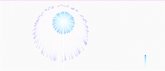

# vue-damp-firework
The interesting component for Vue developers.
<p align="center"></p>

## Contribution Guide

### Installation
```bash
# install packages
yarn add vue-damp-fireworks
or
npm install vue-damp-fireworks
```
### Vue2
```javascript
# global registered in main.js 
import VueFireworks from 'vue-damp-fireworks'
Vue.use(VueFireworks)

# Usage in .vue
<vue-damp-fireworks />
<vue-damp-fireworks :boxHeight="500" :boxWidth="500"/>
<vue-damp-fireworks :boxHeight="500" :boxWidth="500">
    <p>add any element you want</p>
</vue-damp-fireworks>
```

## Demo Page
[Click me to watch the fireworks](https://dampion.github.io/Vue-damp-fireworks/)

<p align="right">
  <a href="https://www.buymeacoffee.com/dampion" target="_blank" rel="noopener noreferrer">
    
  </a>
</p>
